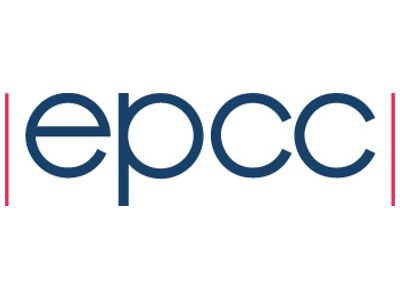

 

     

# Make your Python code 10,000 times faster with parallel numpy!

[![CC BY-NC-SA 4.0][cc-by-nc-sa-shield]][cc-by-nc-sa]

<h3>David Henty, EPCC. 
Wednesday 7th September 2022, 09:00 - 12:30 BST
</h3>

Python is widely used in scientific research for tasks such as data
processing, analysis and visualisation. However, it is not yet widely
used for large-scale modelling and simulation on High Performance
Computer (HPC) architectures due to issues with performance – Python
is primarily designed for ease of use and flexibility, not for
speed. For example, a C program naively translated in to Python can
often be over 100 times slower. However, there are techniques that can
be used to dramatically increase the speed of Python programs such as
fast array processing using numpy, parallelisation using MPI
message-passing and running on HPC systems.

In this hands-on workshop we will illustrate these techniques in
practice by applying them to a toy application which simulates traffic
flow using a simple cellular automaton model. Having developed and
tested the program on your own laptop, we will then move to the UK
National Supercomputer ARCHER2 which has in excess of 750,000
CPU-cores. With a combination of numpy and mpi4py we will aim for a
performance increase of more than a factor of 10,000 compared to the
original program.

As much of the programming as possible will be done using Jupyter
Notebooks, but we will run on ARCHER2 via the standard Slurm batch
scheduling system. Although attendees will be encouraged to write
their own code, full solutions will be provided for all exercises. The
main aim is to illustrate the potential power of supercomputer systems
to new users, and to demystify HPC and parallel programming.

<h3>Requirements</h3>

Participants must bring a laptop with a Mac, Linux, or Windows
operating system (not a tablet, Chromebook, etc.) that they have
administrative privileges on.

<h3>Pre-requisites</h3>

The course assumes a basic understanding of Python programming. You
will also need to be able to run a Jupyter notebook on your own laptop
-- follow the installation instructions at
[https://jupyter.org/install](https://jupyter.org/install).

You will also need an account on the [UK national supercomputer
ARCHER2](https://www.archer2.ac.uk/); full details of how to apply
will be supplied in advance.

<h3>Timetable (all times are in BST)</h3>

<blockquote>This is still a draft workshop page and the material
below comes from previous courses on similar topics. It will be fully
updated in time for this workshop, but is made available here for
reference.</blockquote>

<blockquote>Unless otherwise indicated all material is Copyright
&copy; EPCC, The University of Edinburgh, and is only made available
for private study. </blockquote>

 * 09:00 - 09:10 : Introduction
 * 09:10 - 09:30 : Traffic Model (lecture)
 * 09:30 - 09:45 : Traffic Model (hands-on)
 * 09:45 - 10:10 : Introduction to Numpy Arrays (lecture)
 * 10:10 - 10:30 : Traffic Model with Numpy (hands-on)
 * 10:30 - 11:00 : Coffee Break
 * 11:00 - 11:30 : Message-Passing Concepts (lecture)
 * 11:30 - 11:45 : Log on to ARCHER2 (hands-on)
 * 11:45 - 12:10 : Basic MPI with mpi4py (lecture)
 * 12:10 - 12:30 : Parallel Traffic Model (hands-on)

<h3>Lecture Material</h3>

<h4>Traffic Model</h4>

Based on this existing lecture:

 * [https://media.ed.ac.uk/id/1_bi1jjb9w](https://media.ed.ac.uk/id/1_bi1jjb9w)

<h4>Introduction to Numpy Arrays</h4>

Based on this existing material:

  * [https://youtu.be/_7lnaD_CfEI?t=6507](https://youtu.be/_7lnaD_CfEI?t=6507)

<h4>Message-Passing Concepts</h4>

Based on these existing lectures:

 * [https://media.ed.ac.uk/id/0_c412efsc](https://media.ed.ac.uk/id/0_c412efsc)
 * [https://media.ed.ac.uk/id/0_lflgoo4i](https://media.ed.ac.uk/id/0_lflgoo4i)
 * [https://media.ed.ac.uk/id/0_fwdboeov](https://media.ed.ac.uk/id/0_fwdboeov)

<h4>Basic MPI with mpi4py</h4>

Based on this existing lecture but converted to Python (currently
only covers C and Fortran - all routines are basically the same but
have a more elegant syntax in Python)

 * [https://media.ed.ac.uk/id/0_c21vap59](https://media.ed.ac.uk/id/0_c21vap59)

<h3>Exercise Material</h3>

Sample solutions at:

  * [https://github.com/EPCCed/EPCC-Exercises/tree/main/Traffic/](https://github.com/EPCCed/EPCC-Exercises/tree/main/Traffic/)

We will concentrate on the Python solutions but C and Fortran versions
are also supplied for performance comparison.

Exercise sheet will be a modified and cut-down version of:

  * [Exercises](exercises/ihpcss2022-exercises.pdf)

A much as possible, these exercises will be made available to
attendees via a Jupyter notebook.

---

This work is licensed under a
[Creative Commons Attribution-NonCommercial-ShareAlike 4.0 International License][cc-by-nc-sa].

[cc-by-nc-sa]: http://creativecommons.org/licenses/by-nc-sa/4.0/
[cc-by-nc-sa-image]: https://licensebuttons.net/l/by-nc-sa/4.0/88x31.png
[cc-by-nc-sa-shield]: https://img.shields.io/badge/License-CC%20BY--NC--SA%204.0-lightgrey.svg

[![CC BY-NC-SA 4.0][cc-by-nc-sa-image]][cc-by-nc-sa]

